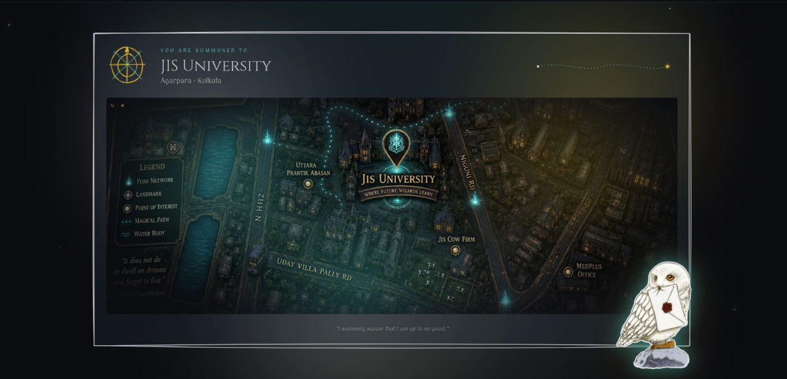

   

  

  # HexaFalls Techfest
  ### A Wizarding Hackathon · 58 hours of code, chaos and conjuring

  *Owls have been dispatched. Robes pressed, wands tuned.*

  GDG JIS University · JIS University, Agarpara, Kolkata

---

## The Prophecy

When the moon hangs low above Agarpara and the owls grow restless, six falls of light shall meet — code, chaos, conjuring, courage, craft and curiosity. For fifty-eight hours the veil thins, and what is built there will travel far beyond the hall.

HexaFalls is a 58-hour techfest hosted by **GDG on Campus · JIS University**, where students from across the country gather to build, compete, and conjure something memorable.

---

## What lives inside

Four tracks, each carrying its own colour and its own kind of magic.

| Track | The brief |
| --- | --- |
| **The Hackathon** | Fifty-eight hours of pure spellwork — full-stack, AI, anything that ships. |
| **Competitive Programming** | Duels of logic. Sharpen the wand, race the clock. |
| **Gaming Arena** | Stadium of charms — controller in hand, glory on the line. |
| **Hardware Hack** | Solder, sparks, sensors. Magic that you can hold. |

Full briefs and prize pools unfurl soon at [hexafalls.org/events](https://hexafalls.org/events).

---

## When & Where

- **Where** — JIS University · Agarpara · Kolkata
- **Hosted by** — GDG on Campus · JIS University
- **Length** — 58 hours, on-site

---

## Join the order

There are several scrolls to choose from:

- **Register** as a participant — opens soon at [hexafalls.org/register](https://hexafalls.org/register)
- **Volunteer** to help run the hall — open now at [hexafalls.org/volunteer](https://hexafalls.org/volunteer)
- **Become a Sponsor** — patrons of the craft sought, scrolls coming soon at [hexafalls.org/sponsors](https://hexafalls.org/sponsors)
- **Mentor or Judge** — wise hands and sharp eyes, call coming soon at [hexafalls.org/judges](https://hexafalls.org/judges)
- **Core Team applications** — the inner circle is gathering at [hexafalls.org/core-team](https://hexafalls.org/core-team)

---

## Send an Owl

- **Email** — teams.hexafalls@gmail.com
- **Instagram** — [@hexafalls_](https://www.instagram.com/hexafalls_/)
- **LinkedIn** — [hexafalls](https://www.linkedin.com/in/hexafalls/)
- **X / Twitter** — [@hexafalls](https://x.com/hexafalls)
- **The Order** — [GDG on Campus · JIS University](https://gdg.community.dev/gdg-on-campus-jis-university-kolkata-india/)

---

*“The hall remembers every wand that was raised within it. Raise yours.”*

**© HexaFalls** · cast with care · no muggles harmed

